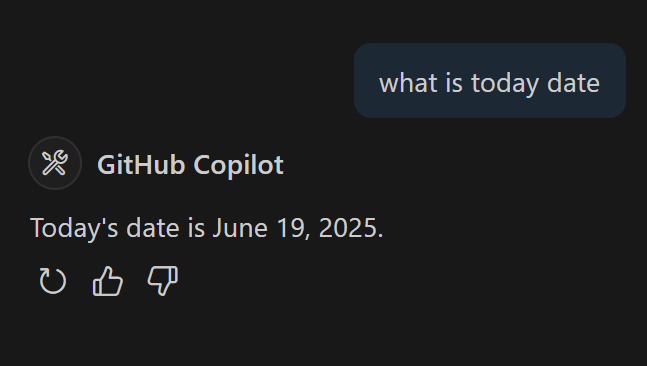

# Workshop: Book API MCP Integration

## Prerequisites - Installation

1. Node Js Latest version
2. Git 
3. Run `npm install -g nodemon` in git bash
4. Install Visual Studio Code

## Start Configuring MCP Server 

### Step 1: Clone this repository in any working folder and navigate to bookish-dollop folder. 


## Step 2: Open bookish-dollop in Visual studio code run `npm install` in the terminal, in config.ts, update MONGO_URI available in https://airforshare.com/.

## Step 3: Run `nodemon' in the terminal

## Step 4: Open new browser and navigate to http://localhost:12345/books/get/all , it should display results as below.


## Step 5: Open index.ts & Copy below lines of code [ Initializing tools and server ]


```
const tools = [
    {
        name: 'get_all_books',
        description: 'list all list of books without id or filter'
    },
    {
        name: 'get_books_by_id',
        description: 'get books based on id',
        inputSchema: {
            type: 'object',
            properties: {
                id: {
                    type: 'string',
                    description: 'get books by id'
                }
            },
            required: ['id']
        }
    }
];
// Server instance
const server = new Server({ name: 'book-api-mcp', version: '1.0.0' }, { capabilities: { resources: {}, tools: {} } });

```

## Step 6: Copy below code to initialize the stdio server in  index.ts

``` 
async function main() {
    try {
        const transport = new StdioServerTransport();
        await server.connect(transport);
        console.error('Server started and listening on stdio');
    } catch (error) {
        console.error('Failed to start server:', error);
        process.exit(1);
    }
}

main(); 

```

## Step 7: Copy below code that lists the tools that is part of our books in  index.ts

```
// List all controller methods as MCP resources
server.setRequestHandler(ListToolsRequestSchema, async () => {
    console.error('ListToolsRequestSchema accessed');
    return {
        tools
    };
});

```

## Step 8: Open one more termial in VS Code and run `npm run build`


## Step 9: Press ctrl+shift+p, and then settings.json and then select "Open user settings"


## Step 10: Copy the below configuration in settings.json, at the end before braces, 

```
  "mcp": {
    "inputs": [],
    "servers": {
      "books-mcp-server": {
        "command": "node",
        "args": [
          "D:/Karthik/sample/books-api-mcp-server/build/src/index.js"
        ]
      }
    }
  }
```

## Step 11: Navigate to your build/src folder in your VSCode of bookish-dollop and get the index.js path and update books-mcp-server arg's mcp

## Step 12: Click on the start button.


## Step 13: Install github co-pilot in visual studio code 


## Step 14: Lets test github copilot by asking date



## Step 15: Change the mode from ask to Agent in github copilot


## Step 16: You should discovered 2 tools. You can see that in output terminal.


## Step 17: Now navigate to index.ts and add below code, so it can expose tools that needs to be used.

```

// ---------- Utility Handlers ----------

async function handleGetAllBooks() {
    console.error('get_all_books called');
    const url = `http://localhost:12345/books/get/all`;
    const response = await fetch(url);

    if (!response.ok) {
        throw new Error(`Books API error: ${response.statusText}`);
    }

    const data = await response.json();
    if (Array.isArray(data)) {
        data.length = Math.min(data.length, 10); // First 10 books
    }

    return {
        content: [
            {
                type: 'text',
                text: JSON.stringify(data, null, 2)
            }
        ]
    };
}

async function handleGetBookById(id: any) {
    console.error('get_books_by_id called with id:', id);
    const url = `http://localhost:12345/books/get/${id}`;
    const response = await fetch(url);

    if (!response.ok) {
        throw new Error(`Books API error: ${response.statusText}`);
    }

    const data = await response.json();

    return {
        content: [
            {
                type: 'text',
                text: JSON.stringify(data, null, 2)
            }
        ]
    };
}

// ---------- MCP Handler ----------

server.setRequestHandler(CallToolRequestSchema, async (request) => {
    console.error('CallToolRequestSchema accessed:', request.params);

    try {
        const toolName = request.params.name;
        const args = request.params.arguments || {};

        switch (toolName) {
            case 'get_all_books':
                return await handleGetAllBooks();

            case 'get_books_by_id':
                if (!args.id) {
                    throw new Error('Missing required argument: id');
                }
                return await handleGetBookById(args.id);
            default:
                throw new Error(`Unknown tool name: ${toolName}`);
        }
    } catch (error) {
        console.error('Error during CallToolRequest:', error);
        throw new Error('Failed to process tool call');
    }
});

```

## Step 20: Build the code by running `npm run build` in the terminal

## Step 21: Click on restart for restarting mcp server in settings.json


## Step 22: Type 'get all books' in copilot window

## Step 23: click on continue when asked. 


## Step 24: you should see books listed, you can ask for book with id


## Step 24: Try asking the copilot on book with some id example 10